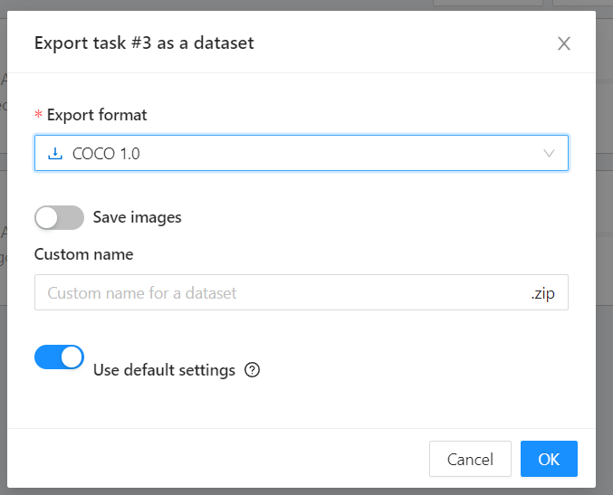
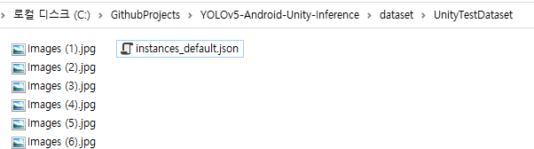
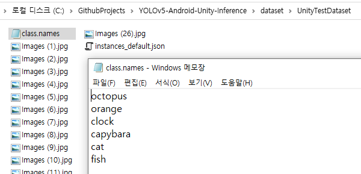
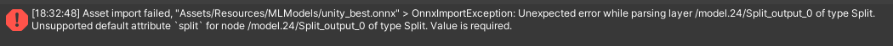
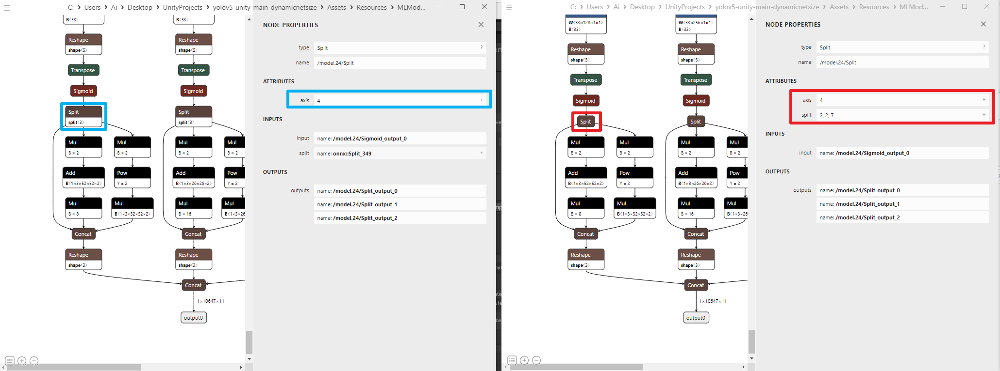

# YOLOv5-ONNX-Training-for-Unity

From start to finish with `YOLOv5 on Windows`: From custom training data to prepare `.onnx` file for `Android Unity inference`.

This repository describes the process of preparing the training data, training `YOLOv5`, and ultimately creating an `ONNX` file that can be used in Unity barracuda.

If you have already prepared an `ONNX` file that can be used in Unity, refer to this [repository](https://github.com/wooni-github/YOLOv5-ONNX-Inference-UnityBarracuda):

1. Prepare custom data and perform labeling using `CVAT`.
2. Training with `YOLOv5` using PyTorch.
3. Verify training results (`ONNX`) using a webcam.
4. Converting to `ONNX` for inference in Unity.

(5. Inference in `Unity`.)

## 0. Prerequisites (on windows)
- git
- Docker
- miniconda
- CUDA, cuDNN

## 1. Prepare custom data and perform labeling using CVAT.
```bash
[git bash]
# From the directory you prefer
cd C:\GithubProjects/

# clone repository
git clone https://github.com/openvinotoolkit/cvat.git
cd cvat
docker-compose up -d
```

Create a folder within the `dataset` folder and add the prepared dataset images.
For example, I created a folder called `UnityTestDataset` inside the `dataset` folder and added the images.
 
```webpage
[webpage]
http://localhost:8080/
```

Create a task and perform labeling. Once labeling is completed, export the task in COCO 1.0 format.
 
 
 
 A `.zip` file will be downloaded. Place the `.json` file inside the `.zip` file into the dataset folder.

```bash
your_directory (GithubProjects)/
├── cvat/
│   └──...
├── YOLOv5-ONNX-Training-for-Unity/
│   ├── dataset/
│       ├── your_dataset (UnityTestDataset)/
│          ├── Images (1).jpg
│          ├── Images (1).txt
│          ├── ...
│          ├── Images (26).jpg
│          └── Images (26).txt
│       ├── instances_default.json
│       ├── class.names
│   ├── convert2Yolo-master/
│       ├── example.py
│       └── split.py
│   └── yolov5-master/
│       ├── requirements.txt
│       └── ...
```

  
 
 Next, create a Miniconda virtual environment and install the packages that suit your development environment.
 
```bash
[git bash]
# on your directory
cd C:\GithubProjects/

# clone this repository
git clone https://github.com/wooni-github/YOLOv5-ONNX-Training-for-Unity

[miniconda prompt]
# on your directory
cd C:\GithubProjects\YOLOv5-ONNX-Unity-Training
conda create -n yolov5Unity python==3.8
conda activate yolov5Unity
pip install -r yolov5-master/requirements.txt

[For my development environment. RTX3080, CUDA 11.6]
pip install torch==1.7.1+cu110 torchvision==0.8.2+cu110 -f https://download.pytorch.org/whl/torch_stable.html
```

Then, create a `class.names` file inside the folder, write the class names on separate lines, and save the file.

 
  
 By executing these commands, you'll ultimately achieve the following file structure, and your data preparation for `YOLOv5` training will be complete.
 Those commands convert the `COCO-formatted` files, which are the output of `CVAT`, into a format that can be utilized by `YOLOv5`. They also divide the data into train and valid sets (default, training 3 : valid 1). 
 
 ```bash
 python convert2Yolo-master/example.py --datasets COCO --img_path dataset/UnityTestDataset --label dataset/UnityTestDataset/instances_default.json --convert_output_path dataset/UnityTestDataset --img_type ".png" --cls_list_file dataset/UnityTestDataset/class.names
 python convert2Yolo-master/split.py --img_path dataset/UnityTestDataset --img_type jpg
```

Refer to my folder structure as an example. I set the default folder `your_directory` to `GithubProjects` and the dataset `your_dataset` to `UnityTestDataset`.

```bash
your_directory (GithubProjects)/
├── cvat/
│   └──...
├── YOLOv5-ONNX-Training-for-Unity/
│   ├── dataset/
│       ├── your_dataset (UnityTestDataset)/
│         └── train/
│             ├── Images (1).jpg
│             ├── Images (1).txt
│             ├── Images (2).jpg
│             ├── Images (2).txt
│             ├── ...
│             ├── Images (26).jpg
│             └── Images (26).txt
│         └── valid/
│             ├── Images (3).jpg
│             ├── Images (3).txt
│             ├── Images (6).jpg
│             ├── Images (6).txt
│             ├── ...
│             ├── Images (24).jpg
│             └── Images (24).txt
│       ├── instances_default.json
│       ├── class.names
│       └── dataset.yaml
│   ├── convert2Yolo-master/
│       ├── example.py
│       └── split.py
│   └── yolov5-master/
│       ├── requirements.txt
│       ├── train.py
│       ├── detect.py
│       ├── export.py
│       ├── export_onnx.py
│       ├── ...
│       ├── yolov5s.pt # volov5 provided
│       ├── yolov5s.onnx # converted .onnx 
│       ├── best.onnx # after running export_onnx.py
│       ├── runs/detect/exp/0.mp4 # after running detect.py
│       └── runs/train/exp/weights/best.pt # after running (training) train.py
```

## 2. Training with YOLOv5 using PyTorch.

- If your OS, GPU, and PyTorch development environment are fully compatible with `Ultralytics YOLOv5`, you should not encounter any major issues. 
- In my case, it wasn't entirely compatible; however, I was able to train and perform inference (using a webcam) in a Miniconda environment. 
- The only issue was that the `export.py` script, which converts the model to `ONNX` format for use in `Unity`, did not work properly (due to a TensorRT problem, I guess). 
- As a result, I performed training and inference in the Miniconda environment and executed the ONNX conversion using Docker.

You can perform training using the command below, and the trained `.pt` file will be saved in the `YOLOv5-ONNX-Training-for-Unity\yolov5-master\runs\train\exp\weights` directory.

```bash
[miniconda - Training]
python yolov5-master/train.py --data dataset/UnityTestDataset/dataset.yaml --epochs 300 --batch-size 128
```

## 3. Verify training results using a webcam.

After the training is completed, if you have a webcam connected, you can use the following command to verify the training results:

```bash
[miniconda Inference using detect.py]
python yolov5-master/detect.py --weights yolov5-master/runs/train/exp/weights/best.pt --source 0
```

 
 
## 4. Converting to ONNX for inference in Unity.

Next, we will convert the `.pt` file to be used in `Unity barracuda`. 
- The original `export.py` from Ultralytics allows conversion to various formats, such as `.onnx`, `.torchscript`, and `TensorFlow`. 
- However, `.engine (TensorRT)` resulted in errors in my development environment. 
- Additionally, as shown in the image below, using the original code for `.onnx` conversion leads to an error when loading the file in Unity. 

 
 
```bash
[error message (unity)]
Asset import failed, "Assets/Resources/MLModels/unity_best.onnx" > OnnxImportException: Unexpected error while parsing layer /model.24/Split_output_0 of type Split.
Unsupported default attribute `split` for node /model.24/Split_output_0 of type Split. Value is required.

Json: { "input": [ "/model.24/Sigmoid_output_0", "onnx::Split_349" ], "output": [ "/model.24/Split_output_0", "/model.24/Split_output_1", "/model.24/Split_output_2" ], "name": "/model.24/Split", "opType": "Split", "attribute": [ { "name": "axis", "i": "4", "type": "INT" } ] }
  at Unity.Barracuda.ONNX.ONNXModelConverter+<>c.<UseStandardImporter>b__27_10 (Unity.Barracuda.ModelBuilder net, Unity.Barracuda.ONNX.ONNXNodeWrapper node) [0x00017] in .\Library\PackageCache\com.unity.barracuda@80909e3320\Barracuda\Runtime\ONNX\ONNXModelConverter.cs:389 
  at Unity.Barracuda.ONNX.ONNXModelConverter.ConvertOnnxModel (Onnx.ModelProto onnxModel) [0x00409] in .\Library\PackageCache\com.unity.barracuda@80909e3320\Barracuda\Runtime\ONNX\ONNXModelConverter.cs:2934 

Unity.Barracuda.ONNX.ONNXModelConverter.Err (Unity.Barracuda.Model model, System.String layerName, System.String message, System.String extendedMessage, System.String debugMessage) (at ./Library/PackageCache/com.unity.barracuda@80909e3320/Barracuda/Runtime/ONNX/ONNXModelConverter.cs:3434)
Unity.Barracuda.ONNX.ONNXModelConverter.ConvertOnnxModel (Onnx.ModelProto onnxModel) (at ./Library/PackageCache/com.unity.barracuda@80909e3320/Barracuda/Runtime/ONNX/ONNXModelConverter.cs:2943)
Unity.Barracuda.ONNX.ONNXModelConverter.Convert (Google.Protobuf.CodedInputStream inputStream) (at ./Library/PackageCache/com.unity.barracuda@80909e3320/Barracuda/Runtime/ONNX/ONNXModelConverter.cs:170)
Unity.Barracuda.ONNX.ONNXModelConverter.Convert (System.String filePath) (at ./Library/PackageCache/com.unity.barracuda@80909e3320/Barracuda/Runtime/ONNX/ONNXModelConverter.cs:98)
Unity.Barracuda.ONNXModelImporter.OnImportAsset (UnityEditor.AssetImporters.AssetImportContext ctx) (at ./Library/PackageCache/com.unity.barracuda@80909e3320/Barracuda/Editor/ONNXModelImporter.cs:65)
UnityEditor.AssetImporters.ScriptedImporter.GenerateAssetData (UnityEditor.AssetImporters.AssetImportContext ctx) (at <a034809d7c214f51bd2d2d89aa481461>:0)
UnityEditorInternal.InternalEditorUtility:ProjectWindowDrag(HierarchyProperty, Boolean)
UnityEngine.GUIUtility:ProcessEvent(Int32, IntPtr, Boolean&)

UnityEngine.GUIUtility:ProcessEvent (int,intptr,bool&)
```


Let's compare the results when using the original ultralytics code versus my code. 

- On the left, an `.onnx` file was created using the a command with the original code :`python export.py --weights yolov5-master/runs/train/exp/weights/best.pt --img 416 416 --include onnx --device 0`
- And on the right, an `.onnx` file was created using the command with my code :  `python export_unity_onnx.py --weights yolov5-master/runs/train/exp/weights/best.pt --img 416 416 --include unity_onnx --device 0`

There is a slight difference, and due to this difference, Unity does not treat the `.onnx` file as a proper asset.


 

Therefore, I recommend converting the file using the new code that I added.

When converting, it's a good to specify the size of the image that will be used for inference with `.onnx`. I set the size to `416x416`.

```bash
[docker - export] 
python export_unity_onnx.py --weights yolov5-master/runs/train/exp/weights/best.pt --img 416 416 --include unity_onnx --device 0
```

Once the conversion is successful, the `.onnx` file is saved in the `yolov5-master` folder. 
When assigning the `.onnx` file to `detect.py` for inference, specify the image size.

```bash
[detect]
python yolov5-master/detect.py --weights yolov5-master/unity_best.onnx --source 0 --imgsz 416 416
```

Now that you have created an `.onnx` file that can be used in `Unity barracuda`, you can refer to this [repository](https://github.com/wooni-github/YOLOv5-ONNX-Inference-UnityBarracuda) for the code to perform inference in Unity.

This repository was developed with reference to the following repositories:
- [CVAT](https://github.com/openvinotoolkit/cvat.git)
- [CVAT coco to YOLO format](https://github.com/ssaru/convert2Yolo) 
- [ultralytics yolov5](https://github.com/ultralytics/yolov5)


